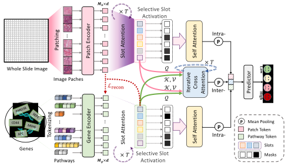

<div align="center">

<h1><a href="https://openreview.net/forum?id=WqCRSn2WAY">Structural Prognostic Event Modeling for Multimodal Cancer Survival Analysis</a></h1>

**[Yilan Zhang](https://scholar.google.com/citations?user=wZ4M4ecAAAAJ&hl), [Li Nanbo](https://scholar.google.com/citations?user=wa2S8OEAAAAJ&hl), [Changchun Yang](https://scholar.google.com/citations?user=pkxQnAYAAAAJ&hl), [J&uuml;rgen Schmidhuber](https://scholar.google.com/citations?user=gLnCTgIAAAAJ&hl), and [Xin Gao](https://scholar.google.com/citations?user=wqdK8ugAAAAJ&hl)**

[](https://openreview.net/forum?id=WqCRSn2WAY)
[](https://arxiv.org/abs/2512.01116)

[](https://github.com/zylvemvet/SlotSPE/stargazers)


</div>

<p align="center">
  
</p>

## Overview

SlotSPE is the official implementation of **Structural Prognostic Event Modeling for Multimodal Cancer Survival Analysis**. The method models sparse, patient-specific structural prognostic events from whole-slide image (WSI) features and omics data, enabling compact multimodal interaction modeling for cancer survival prediction. The latent prognostic events are dynamically instantiated for each patient using a slot attention module, allowing the model to capture individualized prognostic patterns while preserving a concise representation.

<p align="center">
  
</p>


This repository contains:

- the main training and evaluation code for SlotSPE
- packaged clinical metadata, signatures, and fold splits under `dataset_csv/`
- externally hosted RNA feature tables for `dataset_csv/raw_rna_data_inter/`
- a separate preprocessing pipeline under `feature_extract/` for TCGA slide download, patching, and feature extraction

If you run into problems, open an issue or contact `yilan.zhang@kaust.edu.sa`.

## Repository Layout

- `survival.py`: main training and evaluation entrypoint
- `models/`: SlotSPE architecture, slot attention, multimodal fusion, and transformer modules
- `dataset/`: data loading for WSI features, omics inputs, and survival labels
- `dataset_csv/`: clinical tables, pathway/signature definitions, packaged fold splits, and the expected location for downloaded RNA feature tables
- `scripts/`: example cluster launchers; `scripts/SlotSPE.sh` is a SLURM/HPC example
- `feature_extract/`: preprocessing workflow for raw TCGA WSIs
- `figures/`: paper figures used in this README

## Environment Setup

Create a Python environment first:

```bash
conda create -n slotspe python=3.10
conda activate slotspe
```

Install PyTorch for your platform and CUDA setup, e.g.:

```bash
pip install torch torchvision
```

Then install the remaining dependencies:

```bash
pip install -r requirements.txt
```

PyTorch is required by the training code but is not currently listed in `requirements.txt`, so install it separately using the official instructions for your system. The provided training workflow is GPU-oriented. The example launcher in [scripts/SlotSPE.sh](scripts/SlotSPE.sh) targets a SLURM cluster with CUDA available.

## Data Preparation

SlotSPE expects two main inputs:

1. Precomputed WSI feature tensors passed through `--data_root_dir`
2. Metadata and omics tables under `--data_path` (default: `./dataset_csv`)

### WSI feature files

- Each slide is loaded as a PyTorch tensor from `--data_root_dir`
- Filenames are expected to match the slide IDs in the clinical CSVs, with the slide suffix converted to `.pt`
- If a patient has multiple slides, the loader concatenates the corresponding tensors

Example layout:

```text
<data_root_dir>/
  TCGA-XX-XXXX-01Z-00-DX1.pt
  TCGA-YY-YYYY-01Z-00-DX1.pt
  ...
```

### Metadata under `dataset_csv/`

The current training code reads:

- `dataset_csv/clinical/all/<study>.csv` for case IDs, survival labels, censorship indicators, and slide IDs
- `dataset_csv/raw_rna_data_inter/<study>_rna_inter.csv` for omics inputs
- `dataset_csv/signatures/*.csv` for pathway or signature definitions
- `dataset_csv/splits/5fold/<study>/fold_<k>.csv` for train/validation splits

The large RNA feature tables under `dataset_csv/raw_rna_data_inter/` are **not stored in this GitHub repository**. Please download them from Google Drive and place them under `dataset_csv/raw_rna_data_inter/` before running training:

- [Google Drive: raw_rna_data_inter](https://drive.google.com/drive/folders/1RxCjSZYTWhJRnbYWAGySyvZk2RUKYb1t?usp=sharing)

Expected layout:

```text
dataset_csv/
  clinical/
  raw_rna_data_inter/
    blca_rna_inter.csv
    brca_rna_inter.csv
    coadread_rna_inter.csv
    hnsc_rna_inter.csv
    kirc_rna_inter.csv
    luad_rna_inter.csv
    lusc_rna_inter.csv
    skcm_rna_inter.csv
    stad_rna_inter.csv
    ucec_rna_inter.csv
  signatures/
  splits/
```

Packaged 5-fold splits are currently included for:

- `blca`
- `brca`
- `coadread`
- `hnsc`
- `kirc`
- `luad`
- `lusc`
- `skcm`
- `stad`
- `ucec`

## Feature Extraction Pipeline

The root training pipeline does not start from raw WSIs. It expects precomputed slide-level patch features saved as `.pt` tensors.

For preprocessing, use the dedicated materials in [feature_extract/README.md](feature_extract/README.md) or - [Pipeline-Processing-TCGA-Slides-for-MIL](https://github.com/liupei101/Pipeline-Processing-TCGA-Slides-for-MIL), especially:

- `S01-Downloading-Slides-from-TCGA.ipynb`
- `S02-Reorganizing-Slides-at-Patient-Level.ipynb`
- `S03-Segmenting-and-Patching-Slides.ipynb`
- `S04-Extracting-Patch-Features.ipynb`

That submodule also includes CLAM-based tooling and helper scripts for feature extraction with multiple pathology encoders.

## Quick Start

The public training entrypoint is:

```bash
python survival.py
```

A minimal example using the packaged metadata looks like this:

```bash
python survival.py \
  --data_root_dir /path/to/<study>/pt_files \
  --data_path ./dataset_csv \
  --results_dir ./results \
  --study brca \
  --rna_format Pathways \
  --signature combine \
  --label_col survival_months_dss \
  --encoding_dim 1024 \
  --num_patches 4096 \
  --slot_num_wsi 8 \
  --slot_num_omics 8 \
  --slot_iters 10 \
  --temperature 0.01 \
  --topk_ratio 0.25
```

Useful arguments:

- `--data_root_dir`: directory containing slide-level `.pt` feature tensors
- `--data_path`: root directory for `dataset_csv` metadata
- `--study`: cancer type to train on
- `--label_col`: survival endpoint, such as `survival_months_dss`
- `--encoding_dim`: WSI feature dimension expected in the `.pt` files
- `--num_patches`: number of patches sampled during training
- `--slot_num_wsi`: number of WSI slots
- `--slot_num_omics`: number of omics slots
- `--slot_iters`: slot attention iterations
- `--temperature`: gating temperature
- `--topk_ratio`: fraction of slots kept by the top-k gating module

The example script [scripts/SlotSPE.sh](scripts/SlotSPE.sh) shows how these arguments are combined for SLURM-based runs across studies and seeds.

### Expected Outputs

For each run, the code creates a study- and experiment-specific subdirectory under `--results_dir`. The pipeline writes:

- `experiment_settings.txt`: stored experiment configuration
- `log_start_<k_start>_end_<k_end>.txt` or `log_test.txt`: training or test logs
- `split_<fold>_results.pkl`: per-fold validation predictions used by the Kaplan-Meier utility
- `split_<fold>_results_final.pkl`: additional fold result pickle written by `survival.py`
- `summary.csv` or `summary_partial_<start>_<end>.csv`: aggregated fold metrics
- `KaplanMeier-r1.png`: Kaplan-Meier plot generated after cross-validation

## Citation

If this repository is useful in your work, please cite:

```bibtex
@inproceedings{zhang2026slotspe,
  title={Structural Prognostic Event Modeling for Multimodal Cancer Survival Analysis},
  author={Zhang, Yilan and Li, Nanbo and Yang, Changchun and Schmidhuber, J{\"u}rgen and Gao, Xin},
  booktitle={International Conference on Learning Representations (ICLR)},
  year={2026}
}
```

## Acknowledgement

The preprocessing resources under `feature_extract/` build on CLAM-based pathology tooling and related TCGA slide-processing workflows included in this repository.

We thank the following repositories for their contributions:

- [CLAM](https://github.com/mahmoodlab/CLAM)
- [Pipeline-Processing-TCGA-Slides-for-MIL](https://github.com/liupei101/Pipeline-Processing-TCGA-Slides-for-MIL)
